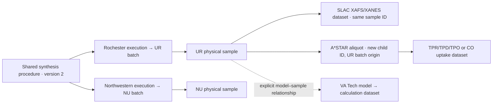

# Consortium sample and data workflow

CATALYST 0.4 records separate identities for the shared synthesis procedure, each laboratory's synthesis execution and batch, individual physical samples, measurement datasets, and computational models. A common procedure connects independent executions for comparison. It never establishes that two batches or samples are the same material.

## The six laboratories

| Lab | ID prefix | Source-format namespace |
| --- | --- | --- |
| A*STAR | ASTAR | astar |
| SLAC | SLAC | slac |
| VA Tech (computational) | VT | virginia-tech |
| Oxeon (pilot scale) | OXEON | oxeon |
| Northwestern | NU | northwestern |
| Rochester | UR | university-of-rochester |

The parenthetical descriptions identify the roles supplied by the consortium; the app does not prohibit those labs from contributing other supported data types. Scale is recorded for synthesis and reactor work, so Oxeon pilot results can retain their actual scale and conditions.

## Physical material workflow

1. **Agree on a shared procedure.** Record its consortium ID, exact version, and shared document or published SciSure protocol reference. Every lab uses the same reference for that version. A changed document requires review and a new procedure version. A mapping profile version is separate from a procedure version.
2. **Register every independent synthesis execution.** In the catalog, select a sample and use **Repeat selected sample’s procedure as a new synthesis** to reuse the common procedure with fresh lab-specific IDs. The previous execution's details are cleared. Record the executing lab, date, actual ELN record, local batch label, and deviations, including an explicit `none` when appropriate. Generate a new synthesis execution ID and batch ID for each independently made batch, even when the composition, procedure, or local nickname matches another batch.
3. **Identify the material.** Generate the batch's root sample ID. An aliquot or treated material receives a new sample ID and a parent link. A derivative keeps its original batch and synthesis-lab attribution, while recording the lab that created the aliquot or treated material and its state. Repeated measurements on the same unchanged specimen reuse its sample ID.
4. **Carry the identity with the material.** Put the full canonical sample ID on the container label or its linked barcode record and packing list, alongside the lab's readable label. The current app generates and displays IDs; barcode printing and scanning are not implemented. A filename is evidence to preserve, not an authoritative sample identity.
5. **Record handoffs.** Keep the sample ID when shipping it. Supply the sending lab, receiving lab, receipt date, and shipment/handoff record. Cross-lab measurements require this evidence. If the receiving lab makes an aliquot, reference the transferred parent and generate a new child ID. Handoff records are contributor declarations, not automatic current-location tracking.
6. **Acquire and process data.** Create a dataset ID for each acquisition or calculation. Record the acquisition lab and person, method/version, date, local run label, source-format lab, submitting lab, and processing lab separately. Register one sample/model subject per submission. Every standardized row carries its canonical subject and dataset IDs.
7. **Review and publish.** Check the Lab & sample lineage tab as well as values and warnings. Approval covers the immutable revision. The app reads saved identities across the active SciSure group before writing, rejects conflicting IDs, checks references and profile versions, and preserves raw files and provenance. Reprocessing the same acquisition creates a new review revision while retaining the dataset ID and its acquisition identity. A new acquisition receives a new dataset ID.

This is an illustrative routing example, not an assignment of techniques or responsibilities to those labs.

## What an identifier means

Generated IDs have the form `CAT-UR-SMP-<32 hexadecimal characters>`. The random suffix allows offline ID creation without relying on a lab counter or synchronized clocks. The prefix identifies the lab that created that record. Types are `BAT` (batch), `SYN` (synthesis execution), `SMP` (physical sample), `DS` (dataset), and `MDL` (computational model).

An aliquot made at SLAC from a Rochester batch has a `CAT-SLAC-SMP-…` sample ID and a `CAT-UR-BAT-…` batch ID. The origin remains Rochester. A SLAC measurement of the unchanged Rochester sample keeps its `CAT-UR-SMP-…` ID and adds a `CAT-SLAC-DS-…` dataset ID. Do not shorten canonical IDs when linking records.

Local labels are stored as exact `(lab, label, canonical ID)` aliases. The same label can refer to different samples, including repeated uses within one lab; the catalog shows separate IDs rather than merging matches. Select the canonical record explicitly. Different samples in one source table require separate submissions or an explicit reviewed split; the app blocks conflicting mapped sample labels.

## Measurements and calculations

| Data type | Required scientific context beyond identity |
| --- | --- |
| Synthesis | Actual synthesis record, shared procedure/version/reference, date, deviations, material state, scale |
| Reactor / pilot testing | Configuration, scale, temperature, absolute pressure, catalyst mass, interval, flow/composition basis, calibration |
| XRD | Radiation/wavelength, geometry, calibration, signal basis, explicit 2θ or q axis/unit |
| XAFS/XANES | Absorber and edge, detection mode, energy reference, calibration, signal basis, explicit energy/k/R axis/unit |
| TPR / TPD / TPO | Pretreatment, gas composition, temperature/time program, flow basis, sample mass, detector units, calibration |
| CO uptake | Pretreatment, adsorption temperature, uptake mass/gas basis, calibration, explicit CO:site assumption or `not calculated` |
| Other spectroscopy | Technique, axis and signal units, calibration, method/version |
| Computational | Model description and input structure, program/version, method/theory level, parameters, environment, convergence, quantity/unit/reference basis |
| Imaging / sample photographs | Image type/technique, what is shown and acquisition conditions, scale/calibration reference or explicit non-quantitative status |

These are contextual validation and explicit CSV/XLSX/flat-record JSON table-import paths. They do not perform phase identification, XAFS fitting, peak integration, dispersion calculations, or computational jobs. Native vendor files, images, PDFs, simulation structures and logs can be preserved as uninterpreted originals beside a table or in a files-and-context-only submission. Their scientific interpretation still requires separate readers and reviewed processing recipes. Images retain their original metadata and bytes; no image analysis or conversion runs. One submission's files share its declared subject, dataset, and context, so unrelated images/runs require separate submissions.

A computational model has its own `MDL` identity and never needs an invented physical batch. Use `no physical link` for a theoretical model. Otherwise declare whether it represents, derives from, or is compared with named physical samples, and record the basis for that relationship. A model being compared to a sample is not evidence that it exactly represents that material. Configuration IDs and computed quantities can be mapped from output tables; units and reference bases must remain explicit. Materially changed model definitions require a new model ID.

## SciSure storage and boundaries

The **Samples & models** catalog reads identity-bearing CATALYST packages across experiments in the token's active group. Search by full ID, batch ID, local alias, or origin lab. Use a selected identity for a new measurement/calculation, or create a linked derivative. Shared identity fields are copied; new acquisition fields are cleared and require review. Completed records can be referenced; incomplete transfers reserve their IDs but cannot establish a new parent/model link.

This version stores the graph in approved JSON attachments beside raw files and transfer receipts. It does not yet create native SciSure inventory Samples, bind submitted procedure references to native protocols, or populate native Used/Generated sample links. The new read-only setup inspector retrieves actual sample types/fields and can inspect an existing sample and exact protocol version. Completing native writes still needs explicit field bindings and tenant tests. Native Samples should ultimately represent physical materials/containers, protocols the shared procedures, and experiments the synthesis/measurement/calculation work. Computational models should remain distinguishable from physical inventory.

Use one accessible consortium group for this first version. The catalog cannot validate links into another group, inaccessible experiments, native-only samples, or older CATALYST packages without structured identities. Publication fails rather than using a partial catalog when a read fails or the 250-review limit is exceeded. There is no additional local database, GitHub research store, or hosted proxy. Direct SciSure requests are explicit refresh/read/publish operations.

Identity and profile checks are client-side and cannot provide an atomic global registry or enforce lab ownership against someone with independent API write access. Shared tokens share the account's permissions; lab and person declarations are self-reported. Individual SciSure tokens preserve each account's API attribution without adding a new sign-in service. Native SciSure permissions and signing remain authoritative.

Older reviews remain readable. Before republishing them, supply the new identity context; original aliases and corrections remain part of the historical record. Conflicting existing canonical definitions require owner review rather than automatic overwriting. Multi-parent material mixtures, full custody inventories, server-enforced uniqueness, and authenticated independent reviewer identities are outside this release.
