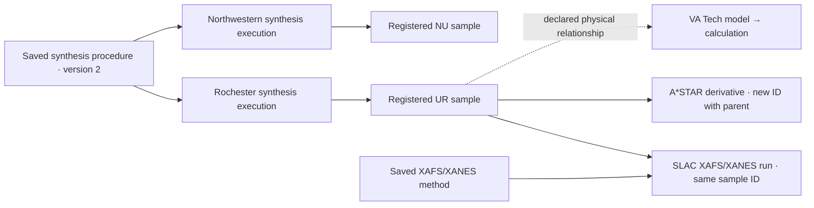

# Consortium sample and data workflow

CATALYST separates reusable sample and procedure definitions from the work performed with them. Register a sample or method once, then select it for each synthesis execution, measurement, or calculation. Sharing a procedure does not mean that independently prepared samples are the same material. The current adaptive workflow replaces the older requirement to repeat synthesis, sample, and measurement details in every upload; older saved reviews keep their original evidence and validation rules.

## The six laboratories

| Lab | ID prefix | Source-format namespace |
| --- | --- | --- |
| A*STAR | ASTAR | astar |
| SLAC | SLAC | slac |
| VA Tech (computational) | VT | virginia-tech |
| Oxeon (pilot scale) | OXEON | oxeon |
| Northwestern | NU | northwestern |
| Rochester | UR | university-of-rochester |

The parenthetical descriptions identify the consortium's supplied roles; the app does not restrict those labs to particular data types. The selected laboratory supplies the generated record ID and default attribution. Acquisition and processing evidence remains in each review package.

## Register definitions, then add work

1. **Save a reusable procedure.** Choose **Reusable procedure / method**. Enter its name, version, type and technique, and provide instructions, a procedure document, or a retrievable reference. A meaningful method change needs a new version. A column-mapping version is separate. **SciSure protocols…** can select an exact published native version and prepare its CATALYST reference for review; it does not create or publish a native protocol.
2. **Register the physical sample.** Choose **Sample information** and enter its readable label and description/composition. CATALYST generates a permanent sample ID. State/treatment, parent and notes are optional. An independently prepared sample gets its own ID; an unchanged sample reused across measurements keeps its existing ID. A derivative should get a new ID with an optional parent link explaining its origin.
3. **Record a synthesis when relevant.** Choose **Synthesis execution**, select the product sample and saved synthesis procedure version, and enter the date and operator. Record run-specific deviations or supporting evidence. A characterization upload does not require a synthesis execution to be invented or re-entered.
4. **Link each measurement.** Choose the measurement technique, search for the existing sample and method, then enter this run's date and operator and attach its files. Preserve original files by default. Method settings belong in the reusable method; unusual conditions or changes belong in run notes. For table conversion, map the source columns and units and supply the required numerical basis.
5. **Add a missing definition without losing the draft.** Use **+ Add new sample** or **+ Add new procedure** beside a selector. Staging the new definition restores the unfinished draft with its new link selected. Queued definitions are labeled and must precede the data referencing them.
6. **Review before sending.** Stage related records in **Batch review**, inspect each item, resolve errors, and approve each exact revision. Editing invalidates approval; changing a definition requires its dependents to be relinked and reviewed. Send approved records in order to the verified destination. A failed or uncertain transfer stops later records and requires inspection rather than a duplicate submission.

This is an illustrative routing example, not an assignment of techniques or responsibilities. Container/barcode labels and shipment records should retain the complete canonical sample ID alongside the readable local label. Barcode printing/scanning and current-location tracking are not implemented. Record transfer evidence in the appropriate notebook record or notes; the adaptive measurement form does not impose legacy custody and synthesis fields on every upload.

## What the form requires

| Record | Required user-entered or selected information |
| --- | --- |
| Sample information | Label and description/composition. IDs and lab attribution are supplied by the app. |
| Reusable procedure / method | Name, version, type, technique, and instructions, an attached document, or an existing reference. |
| Synthesis execution | Registered product sample, saved synthesis procedure version, date and operator. Files and deviations are optional. |
| Characterization / measurement | Registered sample, saved matching method, date, operator and original files. Standardized conversion additionally requires the selected mapping and its numerical units/basis. |
| Computational results | Saved computational method, model description, exact input-structure reference, date, operator and results. Linking physical samples is optional; a stated link needs its relationship and supporting basis. |

The method should contain the settings needed to interpret and repeat that technique: for example XRD radiation/geometry, XAFS edge and detection mode, reaction conditions and calibration, image acquisition/scale information, or computational software/parameters. CATALYST does not require these settings to be copied into every original-file upload. A note or attached record should identify run-specific differences. Preserving the files does not establish scientific validity or verify that a method contains every scientifically necessary detail.

Standardized CSV, XLSX and flat-record JSON paths convert explicitly mapped fields and units. They do not perform phase identification, XAFS fitting, peak integration, dispersion calculations or computational jobs. Native instrument files, images, PDFs, structures and logs can be preserved unchanged. One record's files share its sample/model, method and run details. Use separate records for unrelated subjects or runs; **Batch files…** repeats the displayed details only after confirmation and still requires each record's review.

## Identity and reuse

Generated IDs have the form `CAT-UR-SMP-<32 hexadecimal characters>`. The suffix supports offline creation without a shared counter. `SMP` identifies a physical sample, `PRC` a versioned procedure, `SYN` a synthesis execution, `DS` a dataset/registration record, and `MDL` a computational model. Historical reviews may also contain `BAT` batch IDs. Do not shorten IDs when linking records.

A SLAC measurement of an unchanged Rochester sample keeps its `CAT-UR-SMP-…` ID and receives a new `CAT-SLAC-DS-…` dataset ID. Reprocessing the same acquisition creates a new review revision while retaining that dataset identity. A material change or independent preparation needs its own sample identity; a materially changed computational model needs a new model identity.

Local labels are exact `(lab, label, canonical ID)` aliases. Duplicate names remain distinct choices; search results do not merge samples with similar labels. A later run links the original sample definition without rewriting its description or history. Selected sample and procedure definitions pin exact saved review IDs and checksums. Completed definitions and earlier valid queued definitions can be selected. Partial transfers cannot establish reusable definitions.

Computational models stay distinct from physical inventory. A theoretical model can have no physical link. Otherwise state whether it represents, derives from, or is compared with specified registered samples and provide the basis. Comparison alone is not evidence that a model exactly represents the material. Reference bases and units for numerical results remain explicit.

## SciSure storage and native inventory

Every approved record is stored as a CATALYST experiment package with its context, relationships, approval, originals when present, and verified completion receipt. **Samples & models** and the searchable selectors read completed packages visible in the token's active group. The application adds no local research database or hosted proxy.

Native inventory is an explicit additional choice for eligible sample and physical-work records. Review the native plan before sending: it identifies the exact sample to reuse or create and the Used/Generated relationship to add. The minimal **CATALYST Material v2** type stores stable sample metadata only: canonical ID, creating lab, description/composition, schema version, and optional state/parent. It does not repeat synthesis dates, methods, acquisition settings or operator fields on every sample. See [configuration and migration](scisure-configuration.md).

Existing Material v1 types, fields and research samples are not rewritten during v2 setup. Existing native samples can be selected and verified for reuse instead of duplicated. Native configuration, sample access, file upload and relationship changes depend on the connected account's permissions. A successful read-only inspection does not establish write permission. Native protocol selection keeps its exact published-version reference; it does not publish a new native protocol or turn every attached method document into one.

The catalog is bounded to 250 completed/pending CATALYST reviews visible in the active group; native selectors have their own bounded reads. Inaccessible records and cross-group package links cannot be validated. API pagination permits up to 1,000 results per page, while CATALYST separately caps a loaded list at 1,000 total records. An incomplete read or exceeded application limit stops the operation rather than silently omitting records.

## Review and operating boundaries

Review, field validation, source hashes and read-back verification are client-side integrity checks. They are not an atomic global registry, proof of lab ownership or an authenticated electronic signature. Shared API tokens use the same SciSure account permissions and identity; reviewer names entered in CATALYST are self-reported. SciSure signing and account permissions remain authoritative.

Connection setup follows the supplied eLabNext REST API Quick Start Guide: create a token on the intended server in **Apps & Connections → Manage Authentication**, including after SSO/SAML or two-factor sign-in, then paste only the token into CATALYST. The app handles the authentication header and bounded pagination.

Keep the app open during a transfer and inspect uncertain results before retrying. Writes to sections, inventory and sample relationships are not a transaction. A crash, unknown write response, external editing or permission change can require owner reconciliation in SciSure. Historical reviews remain readable under their original rules; a new adaptive record does not silently relax or rewrite a saved legacy approval. Multi-parent mixtures, full custody inventories, server-enforced uniqueness and independent reviewer authentication remain outside this implementation. No authenticated live tenant verification is claimed; current API behavior is exercised with synthetic fixtures.
